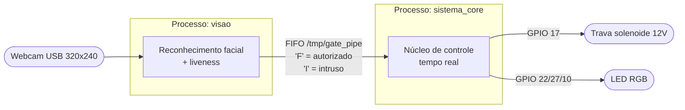
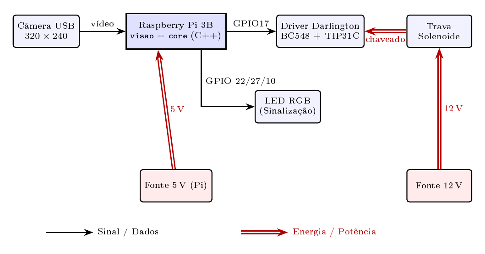
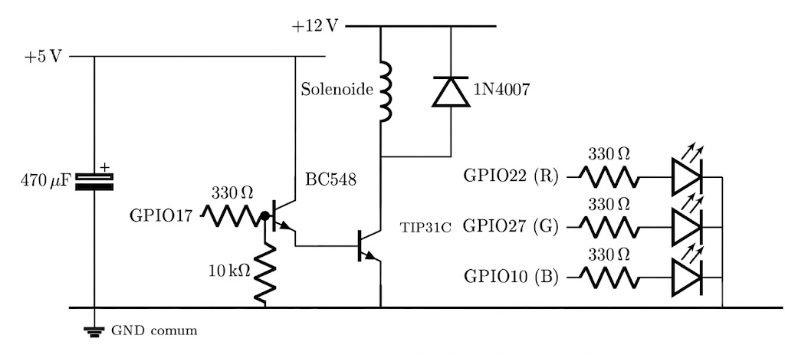
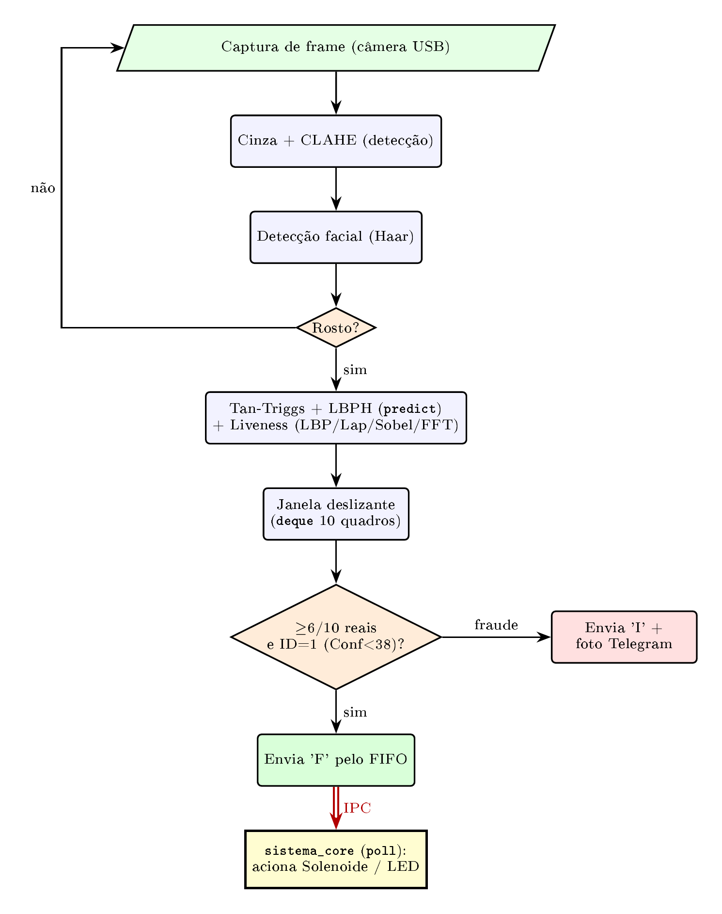

# Sistema de Controle de Acesso Biométrico

### Reconhecimento facial e detecção de vivacidade embarcados, com processamento local e núcleo de tempo real

<p align="center">
  
  
  
  
  
</p>

> Portaria eletrônica residencial que reconhece o morador, detecta ataques de apresentação (foto/tela) e aciona uma trava solenoide, sem enviar nenhum dado biométrico para a nuvem. Todo o processamento acontece dentro de uma Raspberry Pi 3.

**Autor:** Fernando de Melo Colli — 231026349
**Disciplina:** Sistemas Operacionais Embarcados — FCTE / Universidade de Brasília
**Estágio:** PC4 (refinamento final — migração completa de Python para C/C++)

---

## Índice

- [Visão geral](#visão-geral)
- [Arquitetura de software](#arquitetura-de-software)
- [Hardware](#hardware)
- [Como o reconhecimento funciona](#como-o-reconhecimento-funciona)
- [Detecção de vivacidade (liveness)](#detecção-de-vivacidade-liveness)
- [Recursos de tempo real do Linux](#recursos-de-tempo-real-do-linux)
- [Pipeline de visão](#pipeline-de-visão)
- [Como rodar](#como-rodar)
- [Calibração e resultados](#calibração-e-resultados)
- [Estrutura do repositório](#estrutura-do-repositório)
- [Trabalhos futuros](#trabalhos-futuros)
- [Referências](#referências)

---

## Visão geral

Diferente de soluções comerciais como Ring ou Nest, que dependem de servidores externos, este projeto realiza todo o processamento localmente (*Edge Computing*), mantendo o dado biométrico dentro do dispositivo. O sistema é composto por **dois processos concorrentes** que se comunicam por um *pipe* nomeado (FIFO):

| Processo | Papel |
|----------|-------|
| `visao` | Captura a câmera, reconhece o rosto, verifica *liveness* e emite um veredito (`F` = autorizado, `I` = intruso). |
| `sistema_core` | Recebe o veredito e controla o hardware (trava solenoide e LED RGB) com garantias de tempo real. |

**Principais características:**

- Reconhecimento facial **LBPH implementado do zero** — depende apenas do OpenCV base (sem `opencv_contrib`, que leva horas para compilar na Pi).
- Normalização de iluminação **Tan-Triggs** idêntica no treino e na inferência.
- **Classe negativa** para robustez contra intrusos de aparência semelhante.
- **Anti-spoofing** com 4 métricas de vivacidade (LBP, Laplaciano, Sobel, FFT).
- Núcleo de controle com **tempo real**: `mlockall`, `SCHED_FIFO`, afinidade de CPU e tarefa periódica absoluta.
- IPC estável, **sem perda de bytes**, via descritor de leitura persistente com `poll()`.
- Notificação de intruso (foto) via Telegram.

---

## Arquitetura de software



Toda a matemática compartilhada (Tan-Triggs, LBPH, FFT) vive em um único *header*, **`visao_core.hpp`**, o que garante que treino e inferência processem as imagens de forma **idêntica** — a correção central de um bug do estágio anterior.

| Arquivo | Função |
|---------|--------|
| `core.cpp` | Núcleo de controle do hardware + recursos de tempo real |
| `visao.cpp` | Pipeline de visão (reconhecimento + *liveness*) |
| `visao_core.hpp` | Algoritmos compartilhados (Tan-Triggs, LBPH, FFT) |
| `treinar.cpp` | Treino do classificador (captura multi-ângulo e por *datasets*) |
| `extrair_rostos.cpp` | Extração de rostos de terceiros para a classe negativa |
| `Makefile` | Compilação |
| `haarcascade_frontalface_default.xml` | Detector de rostos (Viola-Jones) |

---

## Hardware

### Lista de materiais (BOM)

| Componente | Qtd. |
|------------|:----:|
| Raspberry Pi 3 Model B | 1 |
| Trava Solenoide 12 V | 1 |
| Fonte de Alimentação 12 V | 1 |
| Transistor TIP31C (NPN, potência) | 1 |
| Transistor BC548 (NPN, driver) | 1 |
| Diodo Retificador 1N4007 (*flyback*) | 1 |
| Resistor 330 Ω | 4 |
| Resistor 10 kΩ | 1 |
| LED RGB de cátodo comum | 1 |
| Capacitor Eletrolítico 470 µF / 20 V | 1 |
| Webcam USB | 1 |

### Diagrama de blocos



### Estágio de potência e esquemático

O acionamento da solenoide usa um **par Darlington (BC548 + TIP31C)** como chave de baixo lado:

- **GPIO 17** controla a base do BC548 através de um resistor de **330 Ω**; um resistor de *pull-down* de **10 kΩ** garante o estado desligado sem sinal.
- O coletor do BC548 liga ao **5 V**; o emissor vai à base do TIP31C, cujo coletor chaveia a solenoide.
- A solenoide é alimentada pelo barramento de **12 V**, com um **diodo *flyback* 1N4007** em antiparalelo com a bobina (cátodo no +12 V) para suprimir o pico de tensão reversa no desligamento.
- Um capacitor de **470 µF/20 V** filtra o barramento de 5 V.
- O **LED RGB** (cátodo comum) é acionado pelas **GPIOs 22 / 27 / 10**, cada perna com um resistor de 330 Ω.

> **Terra comum:** as fontes de 5 V (Pi) e 12 V devem compartilhar o **mesmo terra**. A ausência dessa continuidade causa a anomalia do "LED fantasma".



---

## Como o reconhecimento funciona

O classificador é um **LBPH (Local Binary Patterns Histograms) por vizinho mais próximo**, implementado do zero. É importante entender que **ele não constrói um retrato médio** — não existe "borrão" de rostos sobrepostos:

1. **Detecção:** o rosto é localizado na cena pelo **Haar Cascade** (Viola-Jones). *(etapa separada e anterior ao reconhecimento)*
2. **Pré-processamento canônico** (`preprocessarFace`): recorte → redimensionamento para **120×120** → normalização **Tan-Triggs** de iluminação. **Aplicado de forma idêntica no treino e na inferência.**
3. **Descrição:** cada rosto vira um **histograma espacial de LBP** — grade **8×8**, 256 *bins* por célula = vetor de **16.384 floats**.
4. **Classificação (1-NN):** o rosto novo é comparado, por **distância χ²**, contra **todas** as amostras guardadas, e recebe o rótulo daquela **mais próxima**.

### Por que existe uma "classe negativa"

O treino usa **duas pastas**:

| Rótulo | Pasta | Conteúdo |
|:------:|-------|----------|
| **1** | `dataset_fernando/` | Rostos do usuário legítimo (multi-ângulo) |
| **2** | `dataset_outros/` | Rostos de terceiros (a classe negativa) |

Cada imagem é guardada como uma **amostra individual** — a classe negativa é uma **galeria de estranhos**, não uma média. O acesso só é liberado quando `idUsuario == 1`.

**Por que isso torna o sistema robusto?**

- **Sem a classe negativa:** o `predict()` só teria o rótulo 1 e **sempre** devolveria "usuário". A única defesa seria um limiar de distância — uma fronteira **absoluta** (uma esfera de raio `CONF_MAX` em torno das amostras do usuário). Um rosto parecido (um amigo) pode cair dentro dessa esfera e ser aceito, e apertar o raio passa a rejeitar o próprio usuário.
- **Com a classe negativa:** a decisão passa a ser **relativa** — um rosto só é aceito se estiver **mais próximo de uma amostra do usuário do que de qualquer estranho da galeria**. Mesmo que a distância do amigo até o usuário seja baixa, se houver um estranho ainda mais próximo, o vizinho mais próximo é o rótulo 2 → **acesso negado**, independentemente do limiar.

> Em uma frase: troca-se uma fronteira esférica frágil ("está perto de mim?") por uma fronteira de Voronoi discriminativa ("parece mais comigo ou com algum estranho?").

---

## Detecção de vivacidade (liveness)

Para cada quadro, quatro métricas atacam ataques de apresentação (foto impressa ou tela de celular):

| Métrica | O que mede | Limiar |
|---------|-----------|:------:|
| **LBP** (variância de padrões uniformes) | Textura de pele real vs. superfície plana | `> 3.7` |
| **Laplaciano** (variância) | Nitidez / micro-detalhe | `> 28` |
| **Sobel** (desvio do gradiente) | Riqueza de bordas | `> 12` |
| **FFT** (razão de energia alta/baixa freq.) | Detalhe de alta frequência ausente em telas | `> 0.65` |

Um quadro é considerado **REAL** se o *score* ≥ 3 **e** LBP **e** FFT passarem. Os vereditos entram em **janelas deslizantes** (10 quadros): envia-se `F` quando ≥ 6/10 quadros são reais **e** ≥ 6/10 são do usuário autorizado; envia-se `I` (com foto ao Telegram) quando poucos quadros passam.

---

## Recursos de tempo real do Linux

O `sistema_core` emprega recursos de tempo real para garantir **latência determinística** no acionamento da trava:

| Recurso | Chamada de sistema | Efeito |
|---------|-------------------|--------|
| **Memória travada** | `mlockall(MCL_CURRENT \| MCL_FUTURE)` | Impede que páginas vão para o *swap* em um momento crítico |
| **Escalonamento RT** | `SCHED_FIFO` (prioridade 50) | A thread crítica executa assim que o byte chega, sem ser preemptada |
| **Afinidade de CPU** | `pthread_setaffinity_np` | Monitor na CPU 3, LED na CPU 2 — evita migração e *jitter* de cache |
| **Tarefa periódica absoluta** | `clock_nanosleep(CLOCK_MONOTONIC, TIMER_ABSTIME)` | LED em período exato de 100 ms, sem *drift* acumulado |

O núcleo usa duas threads (`std::thread`): uma que escuta o FIFO com `poll()` (sem *busy-wait*) e outra que atualiza o LED. O estado compartilhado é protegido por `std::mutex`, e `SIGINT`/`SIGTERM` garantem encerramento limpo.

> Os recursos de tempo real exigem privilégios — rode o `sistema_core` com `sudo`.

---

## Pipeline de visão



---

## Como rodar

> **Ambiente-alvo:** Raspberry Pi 3 Model B (ou qualquer Linux com OpenCV base e V4L2).

### 1. Dependências

```bash
sudo apt update
sudo apt install -y g++ make libopencv-dev pkg-config
# 'pinctrl' já vem no Raspberry Pi OS recente (usado para as GPIOs)
```

### 2. Compilar

```bash
make            # gera: sistema_core, visao e treinar
```

Para (re)gerar a ferramenta da classe negativa (não incluída no `make all`):

```bash
g++ -O2 -std=c++17 $(pkg-config --cflags opencv4) \
    extrair_rostos.cpp -o extrair_rostos $(pkg-config --libs opencv4)
```

### 3. Treinar o classificador

**a) Capturar o rosto do usuário** (guia interativo de 7 ângulos → salva em `dataset_fernando/`):

```bash
./treinar --capturar
```

**b) Montar a classe negativa** — extraia rostos de fotos de terceiros para `dataset_outros/`:

```bash
./extrair_rostos foto1.jpg foto2.jpg foto3.jpg ...
```

**c) Treinar a partir das duas pastas** (gera `modelo_lbph.txt`):

```bash
./treinar
```

### 4. Calibrar (opcional, recomendado)

Roda o pipeline **sem disparar ações**, só imprimindo métricas — útil para ajustar os limiares:

```bash
./visao --calibrar
```

### 5. Executar o sistema

Em **dois terminais** (ou via `systemd` / `&`):

```bash
# Terminal 1 — núcleo de controle (precisa de sudo p/ tempo real e GPIO)
sudo ./sistema_core
```

```bash
# Terminal 2 — pipeline de visão
./visao
```

Para as notificações do Telegram, defina o token e o *chat id* no topo do `visao.cpp` antes de compilar.

> Os binários carregam `haarcascade_frontalface_default.xml`, `modelo_lbph.txt` e as pastas `dataset_*` **pelo diretório de trabalho atual** — rode-os a partir da pasta onde esses arquivos estão. `make clean` remove os binários.

---

## Calibração e resultados

A calibração foi **iterativa, com pessoas reais**. Os limiares finais:

| Parâmetro | Valor |
|-----------|:-----:|
| `CONF_MAX` (distância χ² máxima) | 38 |
| `LBP_MIN` | 3,7 |
| `LAP_MIN` | 28 |
| `GRAD_STD_MIN` | 12 |
| `FFT_RATIO` | 0,65 |

**Resultados:**

- **Identidade:** usuário legítimo aceito de forma consistente, com `Conf` **34–38 estável** sob variação de iluminação (era **84–98** antes da correção Tan-Triggs).
- **Intruso:** classificado como rótulo 2 em **80–90%** dos quadros → o sistema não abre.
- **Anti-spoofing:** foto em tela de celular → rótulo 2 ou LBP baixo → alerta + notificação no Telegram.
- **IPC:** estável, **sem perda de bytes**, graças ao descritor de leitura persistente com `poll()`.
- **Tempo real:** `mlockall`, `SCHED_FIFO` e afinidade de CPU bem-sucedidos nos quatro núcleos da Pi 3; LED em período exato de 100 ms.
- **CPU:** consumo baixo, pela ausência de *busy-wait* e pelo *sleep* de 150 ms entre quadros.

---

## Estrutura do repositório

```
.
├── README.md
├── Makefile
├── .gitignore
├── core.cpp                              # Núcleo de controle + tempo real
├── visao.cpp                             # Pipeline de visão (liveness + reconhecimento)
├── visao_core.hpp                        # Algoritmos compartilhados (Tan-Triggs, LBPH, FFT)
├── treinar.cpp                           # Treino do classificador
├── extrair_rostos.cpp                    # Extração de rostos p/ a classe negativa
├── haarcascade_frontalface_default.xml   # Detector de rostos
└── docs/
    ├── Trabalho_SOE.pdf                  # Artigo do projeto
    ├── diagrama_blocos.png
    ├── esquematico.png
    ├── fluxograma.png
    └── SOE-v1.fzz                        # Projeto Fritzing do circuito
```

> **Observação:** o modelo `modelo_lbph.txt` e as pastas `dataset_fernando/` e `dataset_outros/` são **dados biométricos**, gerados localmente e **não versionados** (ver `.gitignore`).

---

## Trabalhos futuros

- Substituir o LBPH por **embeddings faciais de rede neural** (mais tolerantes a pose e iluminação).
- Migrar o acionamento de GPIO de `system("pinctrl")` para **libgpiod** (menos *overhead* e mais determinismo na thread de tempo real).

---

## Referências

- P. Viola, M. Jones — *Rapid Object Detection using a Boosted Cascade of Simple Features*, CVPR 2001.
- T. Ojala, M. Pietikäinen, T. Mäenpää — *Multiresolution Gray-Scale and Rotation Invariant Texture Classification with LBP*, IEEE PAMI 2002.
- T. Ahonen, A. Hadid, M. Pietikäinen — *Face Description with Local Binary Patterns*, IEEE PAMI 2006.
- X. Tan, B. Triggs — *Enhanced Local Texture Feature Sets for Face Recognition under Difficult Lighting Conditions*, IEEE TIP 2010.
- W. R. Stevens, S. A. Rago — *Advanced Programming in the UNIX Environment*, 3rd ed., 2013.
- M. Kerrisk — *The Linux Programming Interface*, No Starch Press, 2010.

---

<p align="center">
  <sub>Desenvolvido para a disciplina de Sistemas Operacionais Embarcados — FCTE / UnB · 2026</sub>
</p>
